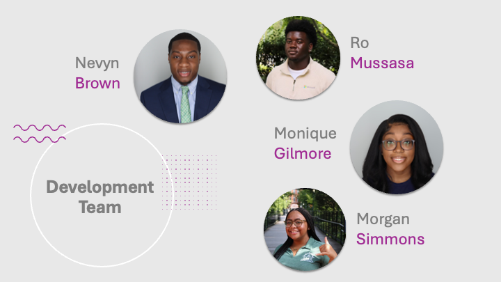

# FundU Crowdfunding App


---

A mobile first crowdfunding platform designed to empower college campus organizations by connecting them with donors and simplifying fundraising efforts. The platform allows student organizations to create fundraiser campaigns, streamline donation collection and visualize campaign analytics.


# Table of Contents

- [Features](#features)
- [Tech Stack](#tech-stack)
- [Project Structure](#project-structure)
- [Frontend](#frontend)
- [Backend](#backend)
- [Deployment Guides](#deployment-guides)
- [DevOps/SecOps](#devopssecops-documentation)
- [Contributors](#contributors)

# Features

User Registration & Authentication 
Homepage showcasing discoverable campaigns
Campaign Manager Page for admins to create/manage campaigns
Donor Page for donor interaction and contributions
QR Code Donation Page for in-person donations
Secure backend APIs for managing data and business logic

# Tech Stack

| **Layer**        | **Technology**                |
|------------------|-------------------------------|
| Frontend         | React Native                  |
| Backend          | Python (Django)               |
| Database         | MySQL                         |
| Authentication   | Django                        |
| Payment          | Stripe                        |
| Cloud Hosting    | AWS (EC2, RDS, S3)            |

# Project Structure

<details>
<summary><strong><a href="frontendV2/">frontendV2/</a> — React Native app (Expo + TypeScript)</strong></summary>

```
├── app/                     # App routes and screens
├── assets/                  # Images, fonts, etc.
├── components/              # Custom UI components
├── constants/               # Shared style constants
├── hooks/                   # Custom hooks (e.g. theming)
├── ios/                     # iOS native files (Xcode)
├── package.json             # Frontend dependencies
└── tsconfig.json            # TypeScript config
```
</details>

<details>
<summary><strong><a href="backend/">backend/</a> — Django backend (REST API)</strong></summary>

```
├── app/                     # Core app: models, views, serializers, routes
├── fundu_backend/           # Project settings, URLs, WSGI/ASGI
├── manage.py                # Django CLI entry point
└── requirements.txt         # Backend dependencies
```
</details>

<details>
<summary><strong><a href="aws/">aws/</a> — Deployment, DevOps, and security configuration</strong></summary>

```
├── deployment-gunicorn-nginx.md   # Production setup (EC2 + Gunicorn + Nginx)
├── server_protection_readme.md    # Fail2Ban, UFW, SSH lockdown
└── README.md                # AWS deployment overview
```
</details>

<details>
<summary><strong><a href="database/">databse/</a> — SQL schema, EER diagrams, and seed files</strong></summary>

```
├── schema.sql               # Core table schema
├── fundu_full.sql           # Full DB dump (if included)
└── seed_and_update.sql      # Insert/update helpers
```
</details>

<details>
<summary><strong><a href="docs/">docs/</a> — Internal planning docs, images, and demo media</strong></summary>

```
├── FundU_App_Demo.mp4       # Project walkthrough video
├── images/                  # Logos, wireframes, team graphics
└── planning/                # Hackathon slides and docs
```
</details>

<details>
<summary><strong><a href="tests/">test/</a> — Frontend and backend test cases</strong></summary>

```
├── test_backend.py
└── test_frontend.js
```
</details>

```
├── README.md                # Main project README
└── LICENSE                  # All Rights Reserved
```
# Frontend
- [Frontend Setup Guide](frontendV2/README.md)  
  Step-by-step instructions for setting up the React Native frontend, including dependencies and project structure.

# Backend
- [Backend Setup Guide](backend/README.md)  
  Django backend configuration, environment setup, and API architecture overview.

# Deployment Guides
- [Backend Deployment (Django + AWS)](aws/README.md)  
  Guide for deploying the Django backend to AWS EC2, including environment setup and MySQL integration.
  
- [Production Deployment: Gunicorn + Nginx + Custom Domain](aws/deployment-gunicorn-nginx.md)  
  Instructions for configuring Gunicorn and Nginx with HTTPS and custom domain routing.

# DevOps/SecOps Documentation
- [Server Protection Documentation](aws/server_protection_readme.md)  
  Firewall, fail2ban, SSH lockdown, and best practices for securing an Ubuntu production server.

# Contributors

- ## [Nevyn Brown](https://github.com/BrownTD)
    - Project Lead
    - Full Stack Development
    - AWS Infrastructure
    - Security Configuration
    - Database Admin
- ## [Ro Musassa](https://github.com/24ro)
    -  Backend Development
- ## [Monique Gilmore](https://github.com/monique3443)
    - Frontend Development
- ## [Morgan Simmons](https://github.com/morgan0paige)
    - Frontend Development



