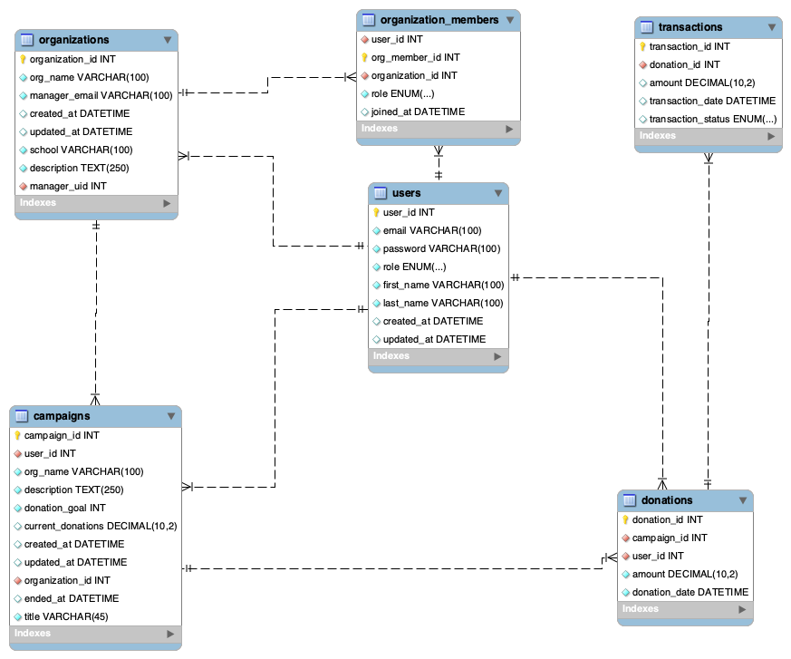

# Database Files for Fundu App

This folder contains all database-related files for the **Fundu App** project. Below is a breakdown of the key files in this directory:

## Files:

### 1. **`schema.sql`**
   - This file contains the complete SQL schema for the Fundu App database, including table creation, indexes, and foreign key constraints.
   - **Usage:** To set up the database, execute the commands in this file using a MySQL client.

### 2. **`fundu_eer.png`**

   - This image provides a visual representation of the **Entity-Relationship Diagram (ERD)** for the Fundu App database.
   - **Usage:** This diagram helps visualize the relationships between the various tables in the database. You can use it as a reference when working with the database schema.

### 3. **`seed_and_update.sql`**
   - This file contains SQL queries used for inserting test data, updating the database structure (e.g., reordering columns, modifying constraints), and any other SQL updates made during development.
   - **Usage:** Run these queries to apply changes to the database, such as inserting data or altering table structures.

## How to Set Up the Database:

1. **Import the schema:**
   - Open MySQL Workbench or another SQL client and run the `schema.sql` file to create the necessary tables and structure for the Fundu App database.

2. **Apply updates:**
   - If any updates or modifications to the database are required, run the `seed_and_update.sql` file to apply those changes.

3. **View the schema:**
   - To better understand the relationships between tables, refer to the `fundu_eer.png` for a graphical view of the schema.
